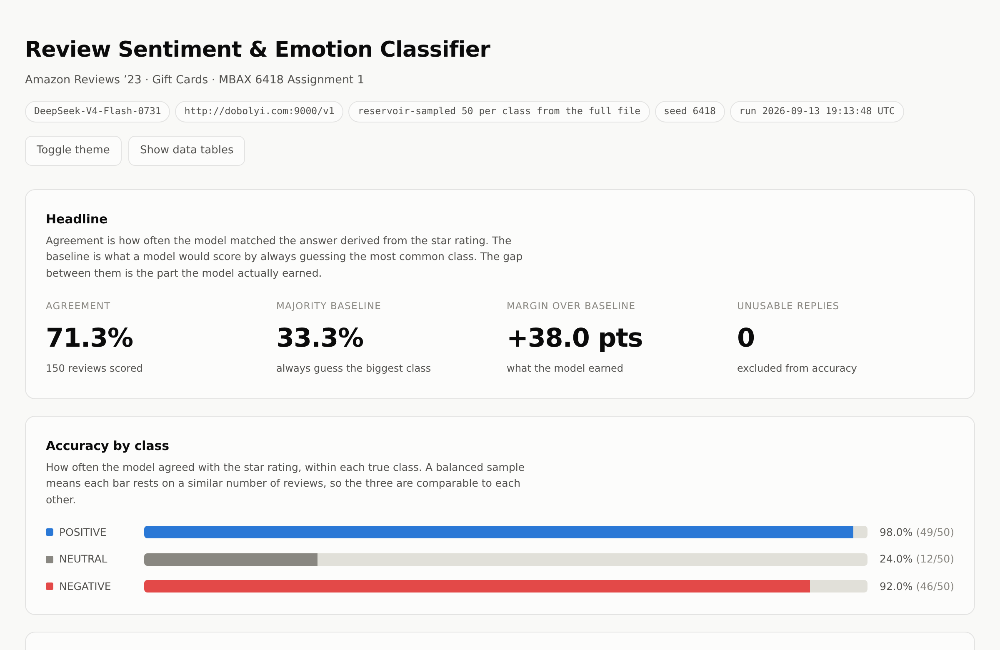
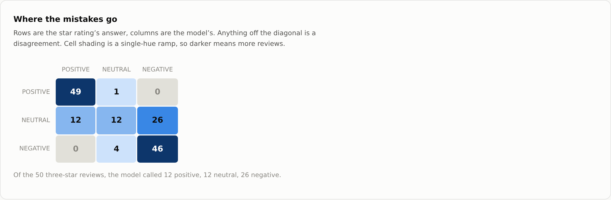
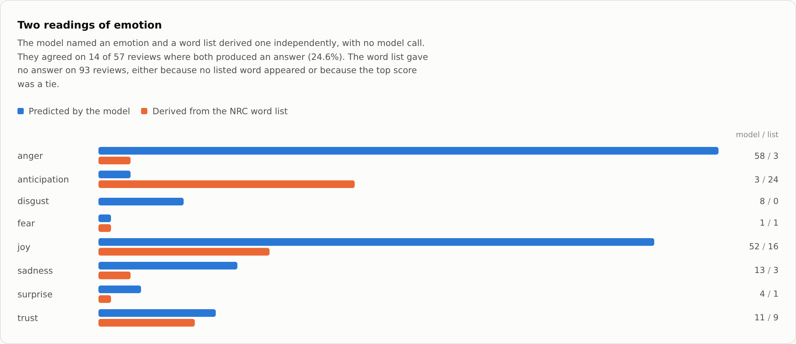
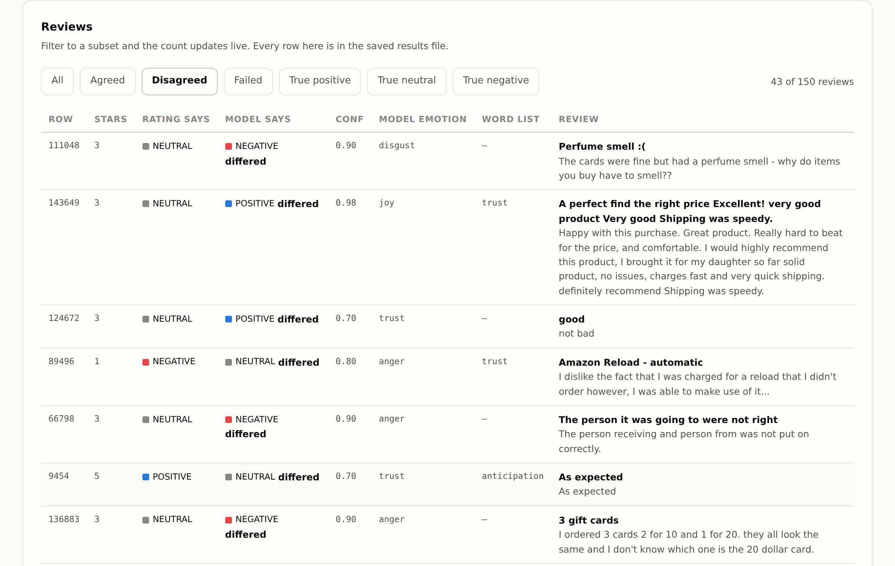
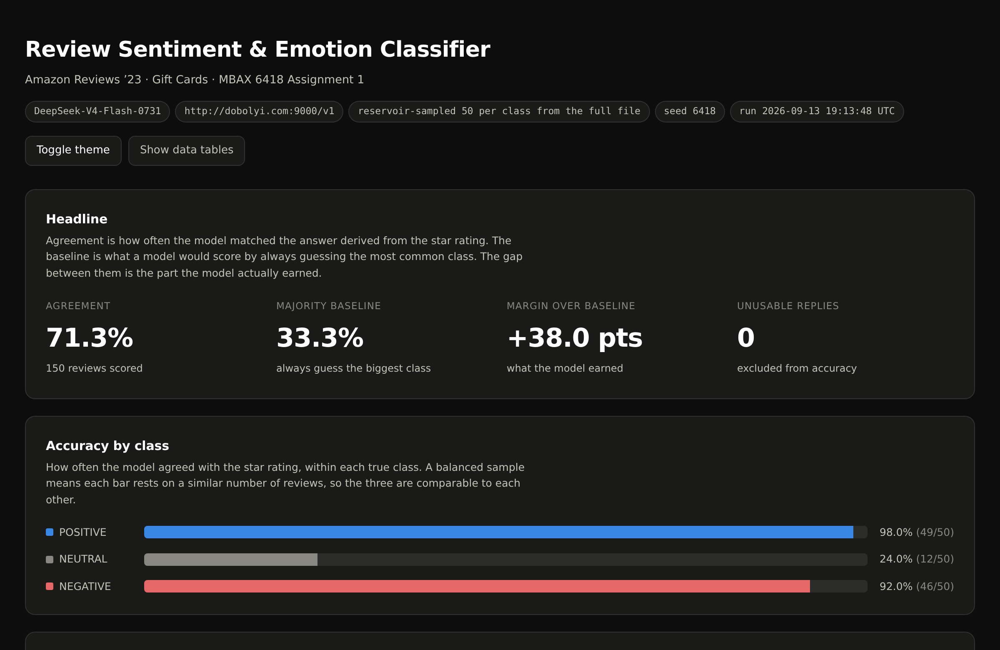

# Review Sentiment & Emotion Classifier

**MBAX 6418 — Assignment 1 · Jacob Appel**

> **DRAFT — REWRITE THE PROSE BEFORE SUBMITTING.**
> Every number below is real and has been checked against
> `results/step6_balanced50.json`. The *words* are the agent's, and the
> assignment grades whether they are yours: *"putting the agent's framing and
> conclusions into your own words is part of the assignment, not an optional
> pass."* Rewrite the narrative, keep the figures. Delete this block when done.
>
> All figures are now in, including the reproducibility measurement in 4b.
> What remains is the prose.

---

## The interface



*Agreement against the majority-class baseline, then accuracy within each true
class. The three sentiment classes use a diverging encoding — blue, gray, red —
because sentiment is polarity data, not an arbitrary set of categories.*



*Rows are the star rating's answer, columns are the model's. Cell shading is a
single-hue ramp, so darker means more reviews. The NEUTRAL row is where every
error lives.*



*The model's emotion distribution against the NRC word list's, over the same
reviews. Two series, so two hues; the pair is validated for colour-vision
deficiency in both light and dark themes.*



*Step 4's interactive filtering. "Disagreed" is selected and the count updates
live to 43 of 150. Six filters are available: all, agreed, disagreed, failed,
and each true class.*



*Dark mode is a selected set of colour steps chosen against the dark surface,
not an inversion of the light theme. Both were validated with the same
contrast and CVD checks.*

---

## What this does

Classifies Amazon Gift Card reviews on two dimensions at once:

- **Sentiment** — POSITIVE / NEUTRAL / NEGATIVE, judged from the review text
  alone, then scored against the star rating the reviewer left.
- **Primary emotion** — one of the eight NRC emotions, produced two independent
  ways: once by the model, and once by a word list with no model involved.

The model never sees the star rating. It is held back and used only as the
answer key.

## Headline result

| | |
|---|---|
| Reviews scored | **150 of 150** (0 unusable) |
| Agreement with the star rating | **71.3%** |
| Majority-class baseline | 33.3% |
| Margin over baseline | **+38.0 points** |

Per class:

| Class | Correct | n | Accuracy |
|---|---|---|---|
| POSITIVE | 49 | 50 | **98.0%** |
| NEUTRAL | 12 | 50 | **24.0%** |
| NEGATIVE | 46 | 50 | **92.0%** |

**The aggregate number hides the actual story.** Remove NEUTRAL and score only
the poles: **95 of 100, 95.0%**. Put NEUTRAL back and the same model gets 12 of
50. This is not a mediocre three-class classifier. It is an excellent binary
classifier being asked a three-class question, and it answers by picking a
pole.

## Data

**Amazon Reviews '23**, Gift Cards category — McAuley Lab, UC San Diego.
<https://amazon-reviews-2023.github.io>
File: `mcauleylab.ucsd.edu/public_datasets/data/amazon_2023/raw/review_categories/Gift_Cards.jsonl.gz`

`data.py` downloads and caches it on first run. Gitignored — large and
re-fetchable.

**NRC Word-Emotion Association Lexicon** (Mohammad & Turney).
<https://saifmohammad.com/WebPages/NRC-Emotion-Lexicon.htm>
**Not included in this repo.** Its licence states: *"Do not redistribute the
data. Direct interested parties to the lexicon home page."* Download the
word-level file yourself and place it in this directory; it is gitignored.
4,454 of its words carry at least one of the eight emotions.

## Configuration

| | |
|---|---|
| Endpoint | `http://dobolyi.com:9000/v1` |
| Model | `DeepSeek-V4-Flash-0731` |
| Temperature | `0.0` |
| Seed | `6418` |
| max_tokens | `2048` |
| Sample | 50 per class, reservoir-sampled from all 152,410 reviews |
| Run time | 228 seconds |
| Structured output | Pydantic `ReviewAnalysis`, validated on every reply |

> **Two documented deviations from the handouts, both deliberate.**
>
> **Model name.** The handout lists `deepseek-ai/DeepSeek-V4-Flash-0731`. That
> 404s. The server serves the bare `DeepSeek-V4-Flash-0731`.
> `check_endpoint.py` asks the server rather than trusting the handout.
>
> **Port.** *Assignment 1 Notes* names `:9001` as the OpenAI-compatible
> endpoint. This project uses `:9000`, for three reasons: the assignment brief
> itself points at *"the one we used to set up Hermes Agent,"* which
> `class-endpoints.txt` labels **Hermes Primary Model** on **:9000**; that same
> file lists `:9001` as serving a **vision** model
> (`cyankiwi/Qwen3.6-35B-A3B-AWQ-4bit`), not the text model this task needs;
> and both were tested directly — `:9000` returns clean JSON with
> `cached_tokens` reported, while `:9001` injects an ~80-token system prompt and
> returns a separate reasoning field. Both are OpenAI-compatible, which is the
> brief's actual requirement. `check_endpoint.py` and `CLASS_BASE_URL` in
> `.env` make the choice explicit and reversible.

## Running it

```bash
python -m venv .venv && source .venv/bin/activate
pip install -r requirements.txt
cp .env.example .env          # paste the class key into .env (gitignored)

python emotion.py             # confirms the lexicon loaded
python check_endpoint.py      # confirms endpoint and model name
python score3.py              # the balanced run -> results/step6_balanced50.json
python dashboard.py           # builds dashboard.html from that file
open dashboard.html
```

Interrupting `score3.py` is safe — progress is checkpointed per review and
re-running resumes.

---

## The four questions

### 1. Why did the lopsided run look accurate, and what did balanced sampling change?

The full Gift Cards file is **152,410 reviews: 134,940 POSITIVE (88.5%),
14,199 NEGATIVE (9.3%), 3,271 NEUTRAL (2.1%)**. A model that answered POSITIVE
unconditionally and read nothing would score **88.5%**.

The Step 2 run made this concrete. Reading the first 100 rows in order gave 93
POSITIVE and 7 NEGATIVE, and under that split the binary classifier scored
**99.0% agreement (98 of 99 scored, 1 unusable) against a 92.9% majority-class
baseline** — a margin of **6.1 points**. Read the 99.0% alone and the model
looks close to perfect. Read it against the baseline and most of the apparent
skill is the sample's shape, not the model's.

Balanced sampling drops the baseline to **33.3%** — one third, because each
class contributes exactly 50 reviews. Measured agreement fell to **71.3%**, but
the *margin over baseline* rose from **6.1 points to 38.0 points**. The model
did not get worse. The measurement stopped flattering it.

Balanced sampling also made NEUTRAL visible at all. At its natural 2.1% rate, a
150-review random sample would contain about three 3-star reviews — too few to
notice that the model cannot classify them. Reservoir sampling put 50 in front
of it, and the failure became impossible to miss.

### 2. Where do the mistakes go?

Rows are the star rating's answer, columns are the model's:

| | POSITIVE | NEUTRAL | NEGATIVE |
|---|---|---|---|
| **POSITIVE** | **49** | 1 | 0 |
| **NEUTRAL** | 12 | **12** | 26 |
| **NEGATIVE** | 0 | 4 | **46** |

**The errors are almost entirely one row.** 38 of 43 total mistakes are 3-star
reviews. Of the 50 3-star reviews:

- **26 (52%) called NEGATIVE**
- 12 (24%) called POSITIVE
- 12 (24%) called NEUTRAL — correct

The direction is asymmetric: when the model abandons NEUTRAL it goes NEGATIVE
more than twice as often as POSITIVE. A mixed review that mentions any concrete
problem — a dented tin, a late delivery, a fee — reads as a complaint, and a
complaint reads as NEGATIVE regardless of how mild it is.

**Nothing crosses the full width.** Zero POSITIVE reviews were called NEGATIVE
and zero NEGATIVE reviews were called POSITIVE. Every single error is one step
on the scale. The model's *ordering* is essentially perfect; only its
*thresholds* for the middle band are wrong.

**The model issues NEUTRAL 17 times out of 150 (11.3%) when the true rate is
33%.** It is not confused about which reviews are mixed — it is reluctant to
say so. The prompt anticipated exactly this and states outright that *"NEUTRAL
is a real answer, not a fallback for uncertainty,"* with an explicit definition
and a worked exclusion. It did not fix the behaviour. That is a stronger
version of the Week 3 slide 22 point than structured outputs alone make:
constraining the output *format* guarantees a valid label, and guarantees
nothing about the label being the right one.

### 3. How do the LLM's emotions and the word list's differ, and why?

**They agree on 14 of 57 comparable reviews — 24.6%.** And "comparable" is
doing heavy lifting: the word list produced **no answer at all on 93 of 150
reviews (62%)**, because it found no lexicon word or hit a tie.

| Emotion | Model | Word list |
|---|---|---|
| anger | 58 | 3 |
| joy | 52 | 16 |
| sadness | 13 | 3 |
| trust | 11 | 9 |
| disgust | 8 | 0 |
| surprise | 4 | 1 |
| anticipation | 3 | **24** |
| fear | 1 | 1 |

The distributions barely overlap, and the single largest disagreement —
**anger → anticipation, 16 times** — has a mechanical cause that is worth
stating precisely:

> In the NRC lexicon, the word **"gift"** is tagged anticipation, joy, surprise
> and trust. Every review in this dataset is about a gift card. So the word list
> reports *anticipation* for furious reviews about gift cards that failed.

The two methods are not measuring the same thing and neither is broken:

- The **word list** counts emotion-associated vocabulary. It has no syntax. It
  cannot see negation ("not scared at all" scores fear), cannot tell whose
  emotion a word denotes, and cannot tell whether a word is doing emotional
  work or is just the product's name.
- The **model** judges the reviewer's stance toward the purchase.

The 62% no-answer rate is the other half of the finding. Gift-card reviews are
short — "Great", "Reload", "Thanks", "...", "?", "🙂" — and a lexicon method
needs vocabulary to count. On this dataset it has almost nothing to work with,
and reporting a tie or a miss as "no answer" rather than guessing is what makes
that visible instead of hidden.

### 4. What bugs and issues came up?

Four worth reporting. Full detail in `notes.md`.

**a) A truncated reasoning budget was silently deleting the model's NEUTRAL
answers.** The first balanced run scored only 137 of 150. All 13 failures were
the same error — empty `content` — because this is a reasoning model that
writes chain-of-thought before its answer, and `max_tokens=512` was being spent
on thinking.

The failures were **not random**: 7 of the 13 were 3-star reviews. The model
thinks longest about the reviews it finds hardest, so truncation removed the
hardest cases first, concentrated in the worst-performing class. NEUTRAL's
accuracy was being computed over the 43 that survived.

Raising `max_tokens` to 2048 recovered all 13 — and the result was the opposite
of what was predicted:

| | max_tokens 512 | max_tokens 2048 |
|---|---|---|
| Scored | 137 / 150 | **150 / 150** |
| NEUTRAL accuracy | 9.3% | **24.0%** |
| NEUTRAL predictions issued | 5 (3.6%) | **17 (11.3%)** |
| Overall agreement | 70.8% | 71.3% |

**6 of the 7 recovered 3-star reviews came back correctly labelled NEUTRAL.**
Arriving at NEUTRAL takes more deliberation than arriving at a pole, so the
token ceiling was systematically censoring one specific answer. NEUTRAL
accuracy more than doubled with no change to the prompt, the model, or the
sample — only the room to think. Overall agreement moved 0.5 points, which is
why an aggregate number is a poor instrument for detecting this.

**b) Output is not fully reproducible, despite a fixed seed and temperature 0.**
Two consecutive runs over identical reviews with identical settings disagreed:
`'Perfume smell :('` was NEUTRAL then NEGATIVE; `'As expected'` was NEUTRAL then
POSITIVE; `'Easy to give'` changed its emotion from joy to trust.

The seed is not the problem. vLLM batches concurrent requests, batch
composition changes the order of floating-point reductions inside the kernels,
and different summation order shifts logits slightly. Near a decision boundary
that is enough to flip the argmax even at temperature 0. Batch composition
depends on what else is hitting the shared class endpoint — other students. The
seed governs sampling and cannot reach any of that.

`check_determinism.py` measures the rate rather than asserting it: the same
reviews classified twice in one sitting, identical settings. Over 17 comparable
reviews:

| What changed between two identical passes | Rate |
|---|---|
| Sentiment | **0 / 17 (0.0%)** |
| Primary emotion | **3 / 17 (17.6%)** |
| Confidence value | **6 / 17 (35.3%)** |

The emotion changes were `joy → sadness`, `sadness → disgust`, and
`sadness → anger` — each a plausible reading of a mixed review, which is the
point: instability shows up exactly where the decision is close.

**This refines the claim rather than confirming it.** Sentiment held steady
across all 17, so the sentiment flip rate is low — but it is not zero, because
two sentiment flips were directly observed between the earlier pair of full
runs. 17 reviews cannot detect a rate of a few percent. The defensible
statement is that **sentiment is mostly stable and emotion and confidence are
visibly not**, and that the assignment's requirement of results "repeatable via
a fixed seed and fixed settings" is not met.

**One review still exhausted 2048 tokens** (`finish_reason=length,
completion_tokens=2048/2048`). Raising the ceiling reduced the truncation
problem from 13 rows in 150 to roughly 1 in 18 on this small sample; it did not
eliminate it. The improved error message is what makes that legible — it
reports the finish reason and the token count instead of inviting a guess.

**c) The endpoint went down and the deadline moved.** Class endpoints failed
from Friday evening; Dobolyi posted a workaround and extended the deadline from
Sep 13 to Sep 15. Two consequences for this code: an explicit 60-second timeout
replaced the library default of 600 seconds with 2 retries — under which a
single stalled call is indistinguishable from a frozen terminal for up to half
an hour — and `score3.py` now checkpoints after every review, so an interrupt
costs one review instead of twenty minutes.

**d) Two rendering bugs the fixture could not catch.** The dashboard was
developed against synthetic data and verified by reading figures back out of the
DOM. Real data broke two things immediately:

- Amazon review bodies contain literal `<br />` tags. The page escapes
  everything it prints, so these rendered as visible `<br />` mid-sentence.
- Emotions with a count of zero still drew a 2px bar, because a `min-width` was
  set on every bar. That is the mirror image of the collapsed-bar bug the
  assignment warns about: instead of real data vanishing, absent data appeared.

Two more were caught earlier by the same DOM-checking method: the confusion
matrix rendered white text on pale blue cells in dark mode (theme-aware ink
token over a fixed colour ramp), and white text on the mid ramp step measured
3.64:1 contrast, under the AA threshold.

---

## Where the star rating fails as ground truth

Worth separating from "the model was wrong," because several of the 38 NEUTRAL
errors look defensible next to the rating:

| Rating | Review | Model said |
|---|---|---|
| 3★ | *"A perfect find the right price Excellent! very good product"* / "Happy with this purchase. Great product." | POSITIVE (0.98) |
| 3★ | *"good"* / "not bad" | POSITIVE (0.70) |
| 3★ | *"Convenient"* / "Simplifies making purchases." | POSITIVE |
| 3★ | *"excelente"* / "siempre me resulta de ayuda…" | POSITIVE (0.95) |
| 3★ | *"Did not receive the amount I chose."* | NEGATIVE (0.90) |

Read the text alone and the model is arguably right in every one. A reviewer
who writes "Excellent! very good product" and leaves 3 stars is carrying
information the text does not contain — a habitual rating style, a partial
refund, a delivery problem resolved offline.

This is why the metric here is called **agreement**, not accuracy. A star
rating is one person's summary of their own review, and the two do not always
match. Any figure in this report that sounds like model quality is really
model-rating concordance.

## Other limitations

- **One category, one run, one endpoint.** Gift Cards only, 150 reviews, one
  seed. Nothing here generalises without rerunning.
- **Run-to-run noise sits on top of sampling noise** (see 4b). No difference of
  a few points between configurations is interpretable, and none is claimed.
- **Confidence is nearly useless as an error signal.** Mean 0.883 overall:
  **0.900 when correct (n=107), 0.840 when wrong (n=43)**. The gap is real but
  far too small to threshold on — several wrong answers carried 0.95.
- **A rating leak exists in the input and was measured, not assumed.** 13 of
  150 reviews (8.7%) have Amazon's auto-generated `"N Stars"` title, which puts
  the rating into a prompt that should never see it. Accuracy on those rows was
  **61.5%** against **72.3%** on the rest — *lower*, not higher. The model is
  not reading the number. Left in place and reported rather than filtered out.
- **The word list is evaluated on 38% of the sample**, since it declined the
  other 62%. Its 24.6% agreement describes only the reviews it could speak to.

## Files

| File | What it is |
|---|---|
| `prompt.py` | System prompt and the Pydantic output schema |
| `classify.py` | Endpoint client, timeout, retries, JSON extraction |
| `emotion.py` | NRC word-list emotion scorer (no model calls) |
| `sample.py` | Seeded, balanced reservoir sampling |
| `score3.py` | Steps 5 + 6 runner, checkpointed — writes the results JSON |
| `dashboard.py` | Builds `dashboard.html` from a saved results file |
| `check_determinism.py` | Measures run-to-run reproducibility |
| `check_endpoint.py` | Reports what the server actually serves |
| `data.py` | Downloads and streams the review file |
| `results/step6_balanced50.json` | The balanced run this report describes |
| `notes.md` | Build log — what broke and what it taught |

`dashboard.py` computes no metrics. Every figure on the page is read out of the
saved JSON, which makes Step 7's instruction checkable: open the dashboard,
compare it to the file, and if they ever disagree the dashboard is wrong. All
**23 figures on the page were verified against the JSON programmatically** by
reading them back out of the rendered DOM, not by eye.
